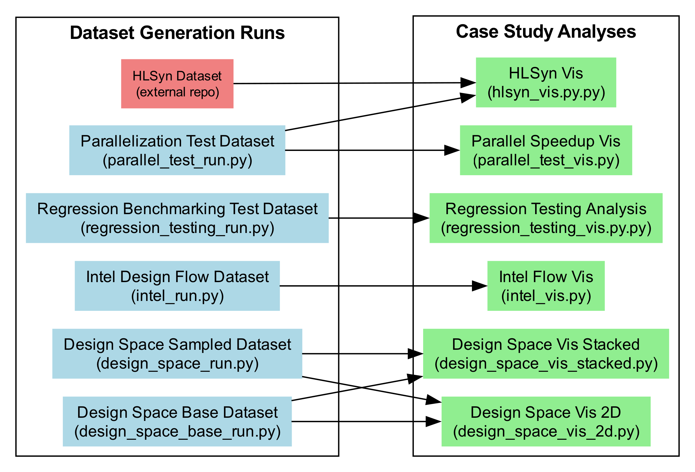

# HLSFactory Artifact Evaluation

This repository contains directions and scripts to reproduce the case studies in the HLSFactory paper as part of the artifact evaluation process.

- [HLSFactory Artifact Evaluation](#hlsfactory-artifact-evaluation)
  - [General Information](#general-information)
  - [Prerequisites](#prerequisites)
    - [Software Environment Setup](#software-environment-setup)
      - [Python Environment Setup](#python-environment-setup)
      - [Vendor Tools Required for Dataset Generation](#vendor-tools-required-for-dataset-generation)
    - [Evaluation Specific Setup](#evaluation-specific-setup)
      - [Vivado and Vitis HLS Environment Variables](#vivado-and-vitis-hls-environment-variables)
      - [Intel HLS Compiler and Quartus Prime Environment Variables](#intel-hls-compiler-and-quartus-prime-environment-variables)
      - [Evaluation Environment Variables](#evaluation-environment-variables)
  - [Evaluation Overview](#evaluation-overview)
    - [Step 0: Ensuring HLSFactory is Working](#step-0-ensuring-hlsfactory-is-working)
    - [Step 1: Generating or Obtaining Datasets](#step-1-generating-or-obtaining-datasets)
      - [Generating Datasets](#generating-datasets)
      - [Obtaining Pre-Generated Datasets](#obtaining-pre-generated-datasets)
    - [Step 2: Running Case Study Analysis Scripts](#step-2-running-case-study-analysis-scripts)

## General Information

For more information on the HLSFactory tool, please refer to the HLSFactory GitHub repository, [https://github.com/sharc-lab/HLSFactory/](https://github.com/sharc-lab/HLSFactory), and the HLSFactory documentation, [https://sharc-lab.github.io/HLSFactory/docs/](https://sharc-lab.github.io/HLSFactory/docs/).

These resources provide:

- HLSFactory's source code
- Detailed explanation of the HLSFactory framework and components
- Demo Python Scripts, Jupyter Notebooks, and Walkthroughs of case studies and use cases for HLSFactory
- Details on how to load custom HLS designs locally at runtime
- Instructions on how to extend HLSFactory locally to support new design frontends and vendor tools
- Guidelines on how to contribute new built-in designs, frontends, and vendor flows to the HLSFactory package for distribution to the community

Please feel free to reach out to the authors of HLSFactory for any questions, comments, or contributions related to HLSFactory as well as any issues or questions about the artifact evaluation process and associated scripts.

## Prerequisites

### Software Environment Setup

#### Python Environment Setup

Users need to have a Python environment set up. We require Python 3.10 or later. We also recommend using a conda-like environment manager to create a virtual environment and install the required packages. We suggest using [mamba](https://mamba.readthedocs.io/en/latest/), as it is usually faster than [conda](https://docs.conda.io/en/latest/), though conda can also be used.

We provide a `pyproject.toml` file to quickly install the required packages using `pip`, as well as an `environment.yml` file to create a `conda` environment.

To create the needed Python environment using `mamba` or `conda`, users can run the following commands

```bash
mamba env create -f environment.yml
```

```bash
conda env create -f environment.yml
```

After creating the environment, users can activate it using the following command:

```bash
mamba activate hlsfactory-ae
```

```bash
conda activate hlsfactory-ae
```

#### Vendor Tools Required for Dataset Generation

If users wish to generate datasets from scratch for case study evaluation rather than source pre-generated datasets, they need to have the following vendor tools installed, as outlined below:

- AMD/Xilinx Vitis HLS, `2021.1` and `2023.1`
- AMD/Xilinx Vivado, `2021.1` and `2023.1`
- Intel HLS Compiler, `21.1.0`
- Intel Quartus Prime, `21.1.0`

Note that not all tools are needed for all case studies. Most case studies only require Vitis HLS and Vivado `2023.1`. The regression testing case study requires both Vitis HLS and Vivado `2021.1` and `2023.1`. The Intel flow case study only requires the Intel HLS Compiler and Quartus Prime `21.1.0`.

As noted, vendor tools are not needed to run the case study analysis scripts if using the pre-generated datasets.

### Evaluation Specific Setup

When running the dataset generation scripts and case study analysis scripts, users need to specify the following environment variables outlined in the sections below. These variables should be defined in the `.env` file located in the root directory of the repository. We provide an initial partially completed `.env` file as a starting point for users to modify with their specific paths. Users are only expected to modify the paths to the vendor tools on their local machines. The default paths for the other environment variables should be sufficient for most users.

#### Vivado and Vitis HLS Environment Variables

- `VIVADO_PATH__<xxx>`: The root path to the Vivado installation directory.
  - Each version of Vivado should have a unique environment variable.
  - Example: `VIVADO_PATH__2023_1=/opt/Xilinx/Vivado/2023.1`
  - Example: `VIVADO_PATH__2021_1=/opt/Xilinx/Vivado/2021.1`
- `VITIS_HLS_PATH`: The root path to the Vitis HLS installation directory.
  - Each version of Vitis HLS should have a unique environment variable.
  - Example: `VITIS_HLS_PATH__2023_1=/opt/Xilinx/Vitis/2023.1`
  - Example: `VITIS_HLS_PATH__2021_1=/opt/Xilinx/Vitis/2021.1`

#### Intel HLS Compiler and Quartus Prime Environment Variables

- `IPP_BIN_PATH`: The path to the Intel HLS Compiler `i++` binary.
- `QUARTUS_SH_BIN_PATH`: The path to the Quartus Prime `quartus_sh` binary.

#### Evaluation Environment Variables

- `DIR_DATASETS`: The directory to save the generated datasets.
  - This directory will require a lot of disk space, as it will contain all the generated datasets.
  - By default, it is set to `./datasets` but can be changed to a different location with more disk space if needed.
- `DIR_FIGURES`: The directory to save the generated figures.
  - By default, it is set to `./figures`.
- `DIR_RESULTS`: The directory to save the generated numerical results.
  - By default, it is set to `./results`.
- `N_JOBS`: The number of cores to use for any parallel processing tasks.
  - By default, it is set to `32`.
  - Mainly used for parallel dataset generation.
  - Also used by some case study analysis scripts to speed up processing.

## Evaluation Overview

There are two steps to evaluate the case studies in the paper:

1. Generating or obtaining the specific dataset for each case study.
2. Running each case study analysis script on the generated dataset to reproduce figures and numerical results.

Each case study analysis script requires a specific dataset. We outline these dependencies in the following diagram for users to determine which dataset is needed for each case study.



- The `Regression Testing Analysis` case study analysis requires the `Regression Benchmarking Test` dataset.
- The `Intel Flow Vis` case study analysis requires the `Intel Flow` dataset.
- The `Parallel Speedup Vis` case study analysis requires the `Parallelization Test` dataset.
- The `HLSyn Vis` case study analysis requires the `Parallelization Test` dataset.
- Both the `Design Space Vis Stacked` and `Design Space Vis 2D` case studies analyses require both the `Design Space Base` and `Design Space Test` datasets.

### Step 0: Ensuring HLSFactory is Working

To ensure that the HLSFactory python package, `hlsfactory`, is working and correctly installed, users can run the following command:

```bash
python -c "import hlsfactory; print(hlsfactory.__name__)"
```

If successful, this should print `hlsfactory` to the console.
This means HLSFactory is working!

### Step 1: Generating or Obtaining Datasets

#### Generating Datasets

To generate all the datasets for the case studies, users can run any of the following commands:
  
```bash
python scripts/design_space_base_run.py
python scripts/design_space_run.py
python scripts/intel_run.py
python scripts/parallel_test_run.py
python scripts/regression_testing_run.py
```

This will generate the datasets in the local `./datasets` directory assuming the default `.env` configuration. This also assumes that the vendor tools are installed and the environment variables are correctly set up.

The dataset generation scripts will take a significant amount of time to run, as they will generate a large number of HLS designs and run them through the vendor tools. This also requires a non-trivial amount of disk space to store the generated datasets.

We estimate it will require approx. 200 GB with the longest run taking 12 to 24 hours assuming the use of a default 32 cores in parallel (which can also be adjusted in the `.env` file).

#### Obtaining Pre-Generated Datasets

If users do not wish to generate the datasets from scratch, they can download the pre-generated datasets which are archived on Zenodo.

Users can run the following command to download the pre-generated datasets:

```bash
python scripts/obtain_pregenerated_datasets.py
```

**IMPORTANT: This flow is not complete and is still a work in progress **due to **the **current**** severe IT** infrastructure outages at Georgia Tech. We will update this as soon as these issues are resolved.**

### Step 2: Running Case Study Analysis Scripts

After generating or obtaining the datasets, users can run the case study analysis scripts to reproduce the figures and numerical results in the paper.

To run the case study analysis scripts, users can run any of the following commands:

```bash
python scripts/design_space_vis_2d.py
python scripts/design_space_vis_stacked.py
python scripts/regression_testing_vis.py
python scripts/hlsyn_vis.py
python scripts/intel_vis.py
python scripts/parallel_test_vis.py
```

This will generate the figures and numerical results in the local `./figures` and `./results` directories assuming the default `.env` configuration.

These scripts assume that the datasets have been generated or obtained and are located in the local `./datasets` directory (or the directory specified in the `.env` file). If the datasets are not found, the scripts will raise an error. Please ensure that the required datasets for a specific case study have been generated or obtained before running the corresponding case study analysis script.

These should be relatively quick to run compared to run, ideally less than 2 minutes total and don't require any additional significant disk space.
